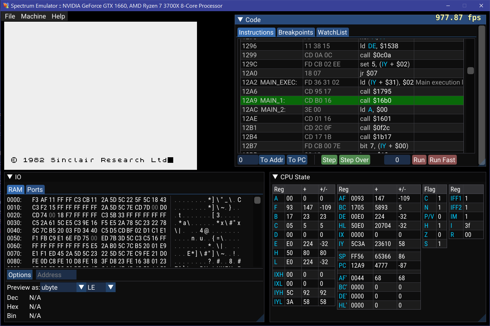

# Emulator

Currently emulates:

- MOS 6502 processor
- Zilog Z80 processor

## Requirements

### Compiler
- Dlang https://dlang.org/

### Dependencies
- Dlang-common https://github.com/pvmoore/dlang-common

### Screenshots

